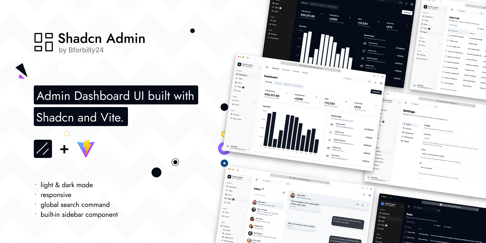

# DentAl Dashboard

Admin Dashboard UI crafted with Shadcn and Vite. Built with responsiveness and accessibility in mind.



I've been creating dashboard UIs at work and for my personal projects. I always wanted to make a reusable collection of dashboard UI for future projects; and here it is now. While I've created a few custom components, some of the code is directly adapted from ShadcnUI examples.

> This is not a starter project (template) though. I'll probably make one in the future.

## Features

- Light/dark mode
- Responsive
- Accessible
- With built-in Sidebar component
- Global Search Command
- 10+ pages
- Extra custom components

## Tech Stack

**UI:** [ShadcnUI](https://ui.shadcn.com) (TailwindCSS + RadixUI)

**Build Tool:** [Vite](https://vitejs.dev/)

**Routing:** [TanStack Router](https://tanstack.com/router/latest)

**Type Checking:** [TypeScript](https://www.typescriptlang.org/)

**Linting/Formatting:** [Eslint](https://eslint.org/) & [Prettier](https://prettier.io/)

**Icons:** [Tabler Icons](https://tabler.io/icons)

## Run Locally

Clone the project

```bash
  git clone https://github.com/bforbilly24/radiographpanoramic-react-frontend-dashboard.git
```

Go to the project directory

```bash
  cd shadcn-admin
```

Install dependencies

```bash
  pnpm install
```

Start the server

```bash
  pnpm run dev
```

## Author

Crafted with 🤍 by [@bforbilly24](https://github.com/bforbilly24)

## License

Licensed under the [MIT License](https://choosealicense.com/licenses/mit/)


```
└── 📁src
    └── 📁actions
        └── 📁auth
            └── post-login.ts
            └── post-logout.ts
        └── 📁predict
            └── post-predict.ts
        └── 📁server
            └── get-server-status.ts
    └── 📁assets
        └── vite.svg
    └── 📁components
        └── coming-soon.tsx
        └── command-menu.tsx
        └── confirm-dialog.tsx
        └── 📁layout
            └── app-sidebar.tsx
            └── 📁data
                └── sidebar-data.ts
            └── header.tsx
            └── main.tsx
            └── nav-group.tsx
            └── nav-user.tsx
            └── team-switcher.tsx
            └── top-nav.tsx
            └── types.ts
        └── long-text.tsx
        └── password-input.tsx
        └── pin-input.tsx
        └── profile-dropdown.tsx
        └── search.tsx
        └── select-dropdown.tsx
        └── skip-to-main.tsx
        └── theme-switch.tsx
        └── 📁ui
            └── alert-dialog.tsx
            └── alert.tsx
            └── avatar.tsx
            └── badge.tsx
            └── button.tsx
            └── calendar.tsx
            └── card.tsx
            └── checkbox.tsx
            └── collapsible.tsx
            └── command.tsx
            └── dialog.tsx
            └── dropdown-menu.tsx
            └── form.tsx
            └── input.tsx
            └── label.tsx
            └── popover.tsx
            └── radio-group.tsx
            └── scroll-area.tsx
            └── select.tsx
            └── separator.tsx
            └── sheet.tsx
            └── sidebar.tsx
            └── skeleton.tsx
            └── switch.tsx
            └── table.tsx
            └── tabs.tsx
            └── textarea.tsx
            └── toast.tsx
            └── toaster.tsx
            └── tooltip.tsx
    └── 📁context
        └── search-context.tsx
        └── theme-context.tsx
    └── 📁features
        └── 📁apps
            └── 📁data
                └── apps.tsx
            └── index.tsx
        └── 📁auth
            └── auth-layout.tsx
            └── 📁forgot-password
                └── 📁components
                    └── forgot-password-form.tsx
                └── index.tsx
            └── 📁otp
                └── 📁components
                    └── otp-form.tsx
                └── index.tsx
            └── 📁sign-in
                └── 📁components
                    └── user-auth-form.tsx
                └── index.tsx
                └── sign-in-2.tsx
            └── 📁sign-up
                └── 📁components
                    └── sign-up-form.tsx
                └── index.tsx
        └── 📁chats
            └── 📁data
                └── convo.json
            └── index.tsx
        └── 📁dashboard
            └── 📁components
                └── overview.tsx
                └── recent-sales.tsx
            └── index.tsx
        └── 📁errors
            └── forbidden.tsx
            └── general-error.tsx
            └── maintenance-error.tsx
            └── not-found-error.tsx
            └── unauthorized-error.tsx
        └── 📁radiographs
            └── 📁components
                └── columns.tsx
                └── data-table-column-header.tsx
                └── data-table-faceted-filter.tsx
                └── data-table-pagination.tsx
                └── data-table-row-actions.tsx
                └── data-table-toolbar.tsx
                └── data-table-view-options.tsx
                └── data-table.tsx
                └── radiographs-dialogs.tsx
                └── radiographs-import-dialog.tsx
                └── radiographs-mutate-drawer.tsx
                └── radiographs-predicted-image-dialog.tsx
                └── radiographs-primary-buttons.tsx
            └── 📁context
                └── radiographs-context.tsx
            └── 📁data
                └── data-copy.tsx
                └── data.ts
                └── enum-data.ts
                └── output-data.tsx
                └── schema.ts
                └── tasks.ts
            └── 📁fffff components
                └── columns.tsx
                └── data-table-column-header.tsx
                └── data-table-faceted-filter.tsx
                └── data-table-pagination.tsx
                └── data-table-row-actions.tsx
                └── data-table-toolbar.tsx
                └── data-table-view-options.tsx
                └── data-table.tsx
                └── tasks-dialogs.tsx
                └── tasks-import-dialog.tsx
                └── tasks-mutate-drawer.tsx
                └── tasks-primary-buttons.tsx
            └── index.tsx
        └── 📁settings
            └── 📁account
                └── account-form.tsx
                └── index.tsx
            └── 📁appearance
                └── appearance-form.tsx
                └── index.tsx
            └── 📁components
                └── content-section.tsx
                └── sidebar-nav.tsx
            └── 📁display
                └── display-form.tsx
                └── index.tsx
            └── index.tsx
            └── 📁notifications
                └── index.tsx
                └── notifications-form.tsx
            └── 📁profile
                └── index.tsx
                └── profile-form.tsx
        └── 📁users
            └── 📁components
                └── data-table-column-header.tsx
                └── data-table-faceted-filter.tsx
                └── data-table-pagination.tsx
                └── data-table-row-actions.tsx
                └── data-table-toolbar.tsx
                └── data-table-view-options.tsx
                └── users-action-dialog.tsx
                └── users-columns.tsx
                └── users-delete-dialog.tsx
                └── users-dialogs.tsx
                └── users-invite-dialog.tsx
                └── users-primary-buttons.tsx
                └── users-table.tsx
            └── 📁context
                └── users-context.tsx
            └── 📁data
                └── data.ts
                └── schema.ts
                └── users.ts
            └── index.tsx
    └── 📁helpers
        └── format-cloumn-name.ts
    └── 📁hooks
        └── use-dialog-state.tsx
        └── use-mobile.tsx
        └── use-toast.ts
    └── 📁lib
        └── utils.ts
    └── 📁routes
        └── __root.tsx
        └── 📁_authenticated
            └── 📁apps
                └── index.lazy.tsx
            └── 📁chats
                └── index.lazy.tsx
            └── 📁help-center
                └── index.lazy.tsx
            └── index.tsx
            └── 📁radiographs
                └── index.lazy.tsx
            └── route.tsx
            └── 📁settings
                └── account.lazy.tsx
                └── appearance.lazy.tsx
                └── display.lazy.tsx
                └── index.lazy.tsx
                └── notifications.lazy.tsx
                └── route.lazy.tsx
            └── 📁users
                └── index.lazy.tsx
        └── 📁(auth)
            └── 500.tsx
            └── forgot-password.lazy.tsx
            └── otp.tsx
            └── sign-in-2.lazy.tsx
            └── sign-in.tsx
            └── sign-up.lazy.tsx
        └── 📁(errors)
            └── 401.lazy.tsx
            └── 403.lazy.tsx
            └── 404.lazy.tsx
            └── 500.lazy.tsx
            └── 503.lazy.tsx
    └── 📁stores
        └── authStore.ts
    └── 📁types
        └── environment.ts
    └── 📁utils
        └── handle-server-error.ts
    └── index.css
    └── main.tsx
    └── routeTree.gen.ts
    └── vite-env.d.ts
```